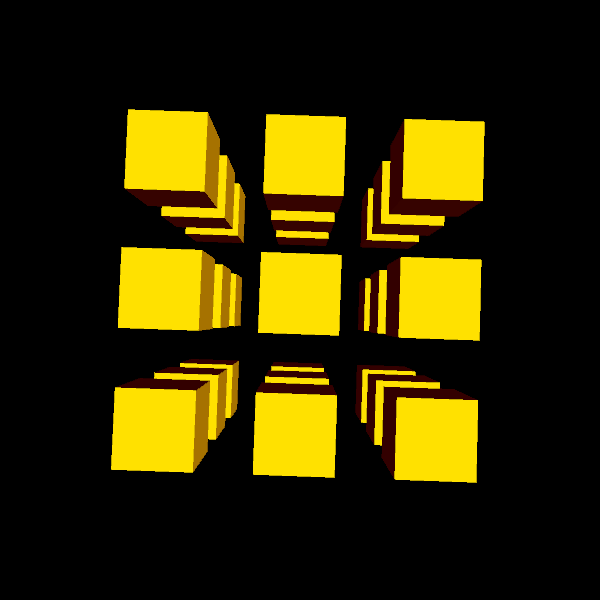

# entregaShader2
segunda entrega de shaders
Autor: Samuel Trujillo Santana

## Descripción
El trabajo consiste en unas modificaciones a unos de los ejemplos mostrados en clase para darle una apariencia distinta. El programa reacciona al movimiento del ratón, poniendo la luz con origen en su posición, y al clicar cambias los colores.

## Vista del programa funcionando

## Referencias

Guión de prácticas de CIU

Referencias Processing https://processing.org/reference/

Librería GifAnimation https://github.com/extrapixel/gif-animation
